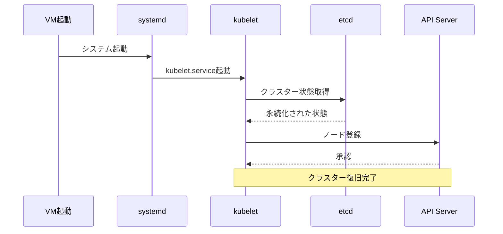

# Kubernetes運用ガイド

## 🔍 クラスターの永続性について

### ✅ 正しい理解

**K8sクラスターは永続的です！** VMを再起動しても、クラスターは自動的に復旧します。



### 🔄 自動復旧の仕組み

1. **VM起動** → systemdがkubeletを自動起動
2. **kubelet起動** → etcdからクラスター状態を取得
3. **ノード登録** → API Serverにノードを登録
4. **Pod復旧** → 以前のPodを自動的に再作成

## 📁 リポジトリ構成の役割

### 01-vm-creation/ - VM作成（初回のみ）

```bash
# 初回のみ実行
cd 01-vm-creation
./create-vms.sh
```

**役割:**

- Proxmox上にVMを作成
- 基本的なOS設定
- SSH接続設定

### 02-k8s-cluster/ - K8sクラスター構築（初回のみ）

```bash
# 初回のみ実行
cd 02-k8s-cluster
./setup-k8s-cluster.sh
```

**役割:**

- Kubernetesクラスターの初期化
- CNI（Flannel）のインストール
- kubeconfigの生成

### 03-manifests/ - 基盤サービス（必要に応じて）

```bash
# 基盤サービスを追加
kubectl apply -f 03-manifests/monitoring/
kubectl apply -f 03-manifests/istio/
```

**役割:**

- 監視システム（Prometheus、Grafana）
- Service Mesh（Istio）
- ログ集約（Loki）

### 04-applications/ - アプリケーション（継続的）

```bash
# アプリケーションをデプロイ
kubectl apply -f 04-applications/sample-app/
```

**役割:**

- ビジネスアプリケーション
- 継続的なデプロイ・更新

## 🚀 日常的な運用フロー

### 1. 初回セットアップ（一度だけ）

```bash
# Step 1: VM作成
cd 01-vm-creation
./create-vms.sh

# Step 2: K8sクラスター構築
cd ../02-k8s-cluster
./setup-k8s-cluster.sh

# Step 3: 基盤サービス追加
kubectl apply -f ../03-manifests/monitoring/
kubectl apply -f ../04-applications/sample-app/
```

### 2. 日常的な運用（VM再起動後）

```bash
# VM再起動後、クラスターは自動復旧
# 確認のみ
kubectl get nodes
kubectl get pods -A

# 新しいアプリケーションをデプロイ
kubectl apply -f 04-applications/sample-app/
```

### 3. アプリケーション更新

```bash
# 設定変更
vim 04-applications/sample-app/deployment.yaml

# 更新適用
kubectl apply -f 04-applications/sample-app/

# ロールアウト確認
kubectl rollout status deployment/sample-web-app -n sample-app
```

## 🔧 kubeconfigの管理

### 現在のkubeconfigの場所

```bash
# Proxmox上
/root/k8s-on-proxmox-ansible/02-k8s-cluster/kubeconfig

# ローカルから使用
export KUBECONFIG=/path/to/kubeconfig
kubectl get nodes
```

### kubeconfigの特徴

- **永続的**: クラスターが存在する限り有効
- **認証情報**: 管理者権限の証明書
- **接続先**: API Serverの場所（192.168.10.101:6443）

## 📊 実際の運用例

### シナリオ1: VM再起動後

```bash
# 1. VM再起動
ssh root@192.168.10.108 "reboot"

# 2. 数分待機（自動復旧）

# 3. クラスター状態確認
ssh root@192.168.10.108 "cd /root/k8s-on-proxmox-ansible/02-k8s-cluster && export KUBECONFIG=./kubeconfig && kubectl get nodes"
# 結果: 全ノードがReady状態で復旧

# 4. アプリケーション確認
kubectl get pods -A
# 結果: 以前のPodが自動的に再作成されている
```

### シナリオ2: 新しいアプリケーション追加

```bash
# 1. 新しいアプリのマニフェスト作成
vim 04-applications/new-app/deployment.yaml

# 2. デプロイ
kubectl apply -f 04-applications/new-app/

# 3. 確認
kubectl get pods -n new-app
```

### シナリオ3: アプリケーション更新

```bash
# 1. 設定変更
vim 04-applications/sample-app/deployment.yaml

# 2. 更新適用
kubectl apply -f 04-applications/sample-app/

# 3. ロールアウト確認
kubectl rollout status deployment/sample-web-app -n sample-app
```

## ⚠️ 注意点

### クラスターが復旧しない場合

```bash
# 1. ノード状態確認
kubectl get nodes

# 2. システムログ確認
journalctl -u kubelet -f

# 3. CNI再インストール（必要時）
kubectl apply -f https://github.com/flannel-io/flannel/releases/latest/download/kube-flannel.yml
```

### データの永続化

- **etcd**: クラスター状態（永続化済み）
- **Pod**: ステートレス（再作成される）
- **PersistentVolume**: データ永続化（要設定）

## 🎯 推奨ワークフロー

### 開発環境

1. **初回**: VM + K8sクラスター構築
2. **日常**: kubectl apply でアプリデプロイ
3. **更新**: マニフェスト修正 → kubectl apply

### 本番環境

1. **初回**: VM + K8sクラスター構築
2. **基盤**: 監視・ログ・Service Mesh追加
3. **アプリ**: GitOps（ArgoCD）で自動デプロイ
4. **更新**: Git push → 自動デプロイ

## 📚 参考情報

- [Kubernetes Concepts](https://kubernetes.io/docs/concepts/)
- [kubectl Cheat Sheet](https://kubernetes.io/docs/reference/kubectl/cheatsheet/)
- [Persistent Volumes](https://kubernetes.io/docs/concepts/storage/persistent-volumes/)
