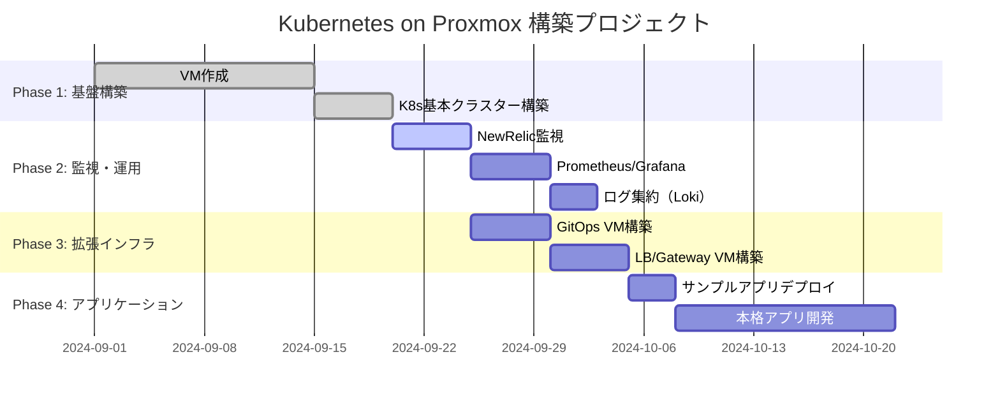
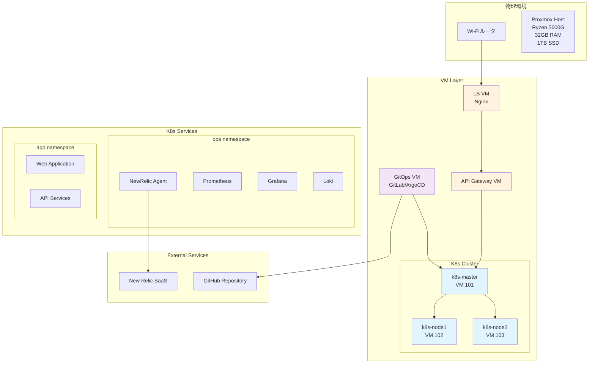
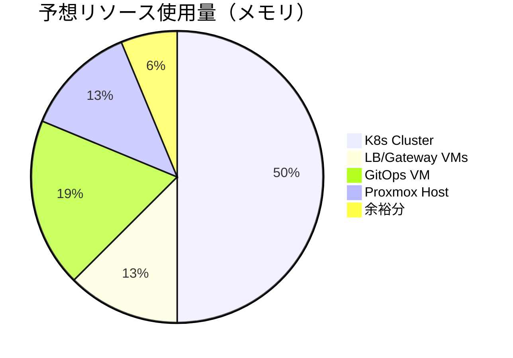

# プロジェクト進捗管理

## 📊 全体進捗状況



## 🏗️ システム構成図



## ✅ 完了済みタスク

### Phase 1: 基盤構築

- [x] ProxmoxVE環境構築
- [x] VM作成スクリプト整備（Shell + Ansible）
- [x] Kubernetesクラスター構築（Shell + Ansible）
- [x] CNI（Flannel）セットアップ
- [x] 基本的な動作確認

### インフラ詳細

- [x] VM構成: Master×1, Worker×2（VM 101-103）
- [x] ネットワーク: 192.168.10.0/24
- [x] ストレージ: local-lvm
- [x] OS: Ubuntu 22.04 LTS

## 🔄 進行中タスク

### Phase 2: 監視・運用基盤

- [ ] **NewRelic監視セットアップ** ← 次のタスク
- [ ] 運用管理ネームスペース作成
- [ ] Prometheus/Grafana構築
- [ ] ログ集約（Loki）構築

## 📋 予定タスク

### Phase 3: インフラ拡張

- [ ] **GitOps VM構築**
  - [ ] 専用VM作成（k8sクラスター外）
  - [ ] GitLab CE インストール
  - [ ] ArgoCD セットアップ
  - [ ] CI/CD パイプライン構築

- [ ] **LB/Gateway VM構築**
  - [ ] Nginx LB VM作成
  - [ ] API Gateway VM作成
  - [ ] SSL/TLS証明書管理
  - [ ] トラフィック制御設定

### Phase 4: アプリケーション

- [ ] サンプルアプリケーション本格デプロイ
- [ ] 本番アプリケーション開発・デプロイ
- [ ] パフォーマンス最適化

## 💻 物理リソース管理

### 現在のスペック

```yaml
CPU: AMD Ryzen 5 5600G
  - コア数: 6コア/12スレッド
  - ベースクロック: 3.9GHz
  - 統合GPU: Radeon Graphics

メモリ: 32GB DDR4
  - 現在使用量: ~60% (約19GB)
  - 利用可能: ~13GB

ストレージ: 1TB SSD
  - 現在使用量: ~40% (約400GB)
  - 利用可能: ~600GB

ネットワーク: 1Gbps Ethernet
```

### リソース使用量予測



### 拡張計画

- [ ] **短期拡張（必要に応じて）**
  - [ ] メモリ増設: 32GB → 64GB
  - [ ] ストレージ追加: 2TB SSD
  
- [ ] **長期拡張（スケールアウト）**
  - [ ] 追加物理ノード検討
  - [ ] Proxmoxクラスター化

## 🎯 次のアクション

### 1. NewRelic監視セットアップ（今日）

```bash
# 運用ネームスペース作成
kubectl create namespace ops

# NewRelic Helm Chart デプロイ
# ライセンスキー設定
# ダッシュボード確認
```

### 2. 追加VM作成計画

```yaml
VM_IDS: [105, 106, 107]  # 新規追加
VM_NAMES: ["gitops-server", "nginx-lb", "api-gateway"]
VM_IPS: ["192.168.10.105", "192.168.10.106", "192.168.10.107"]
VM_ROLES: ["gitops", "loadbalancer", "gateway"]
```

## 📈 成功指標（KPI）

- [ ] **可用性**: 99.9%以上のアップタイム
- [ ] **パフォーマンス**: API応答時間 < 200ms
- [ ] **監視**: 全コンポーネントの可視化
- [ ] **自動化**: GitOpsによる自動デプロイ
- [ ] **セキュリティ**: SSL/TLS、認証・認可

## 🔗 関連リンク

- [New Relic Kubernetes Integration](https://docs.newrelic.com/docs/kubernetes-pixie/kubernetes-integration/get-started/introduction-kubernetes-integration/)
- [GitLab CE Documentation](https://docs.gitlab.com/ee/install/)
- [ArgoCD Getting Started](https://argo-cd.readthedocs.io/en/stable/getting_started/)
- [Nginx Load Balancing](https://docs.nginx.com/nginx/admin-guide/load-balancer/)

---
**最終更新**: 2024-09-20
**次回レビュー**: 2024-09-25
